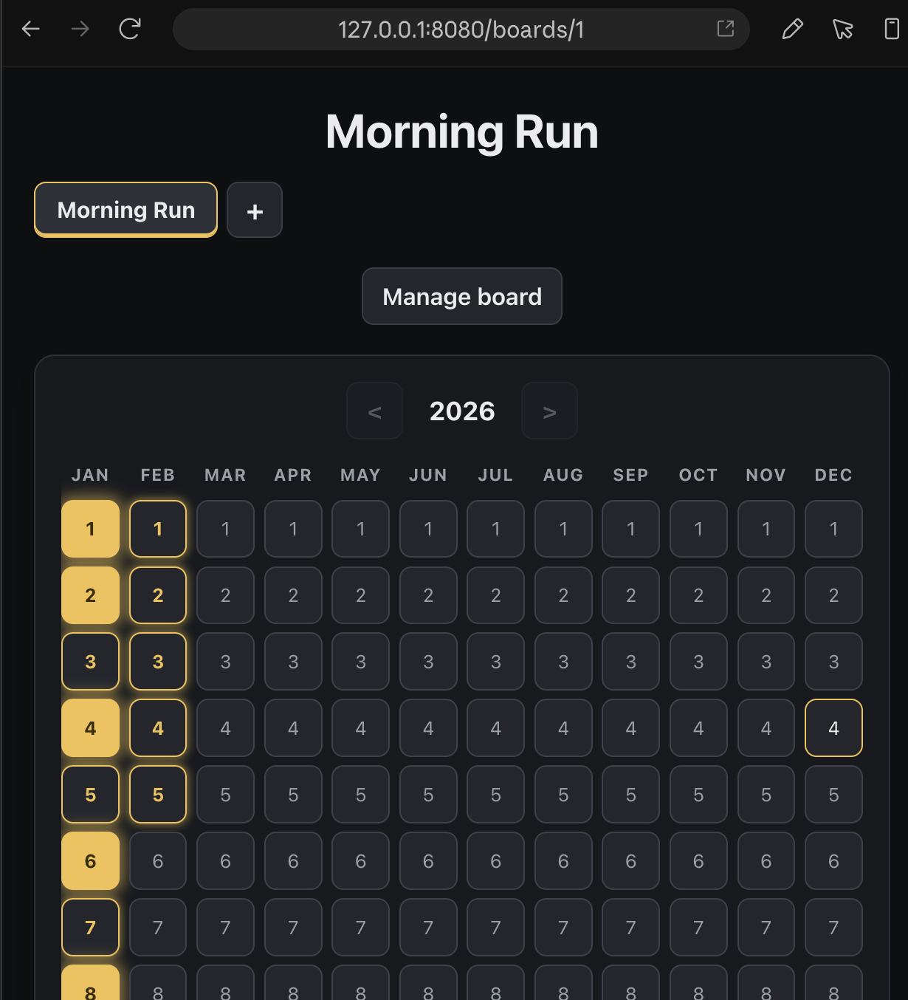

# stars

A small, self-hosted **every-day calendar** — a digital take on
[Simone Giertz's Every Day Calendar](https://www.kickstarter.com/projects/simonegiertz/the-every-day-calendar).
Each board is a year with one column per month and one cell per day. Click a
cell to cycle it through three states and build a streak.



## Features

- **Tri-state cells** — click to cycle: empty → outline glow → full glow → empty.
- **Per-year boards** — navigate years with `‹` / `›`, bounded by the board's
  creation year and the current year.
- **Today** is always marked with a white ring, whatever its state.
- **Multiple boards** as tabs; create, rename, and archive from a popover.
- **Multi-user** — identity comes from an upstream [Authelia](https://www.authelia.com/)
  forward-auth proxy; users are provisioned on first sight and their boards are
  isolated from each other.
- Light / dark theme following the system preference.

## Tech

Rust · [axum](https://github.com/tokio-rs/axum) · [sqlx](https://github.com/launchbadge/sqlx)
+ SQLite (WAL) · [askama](https://github.com/askama-rs/askama) templates ·
[HTMX](https://htmx.org/). Static assets are embedded in the binary, which ships
as a ~10 MB static-musl distroless container.

## Run locally

```bash
DEV_USER=dev DATABASE_URL=sqlite://stars.db cargo run
# open http://localhost:8080
```

`DEV_USER` supplies a fake identity so the app is usable without the auth proxy.
**Never set it in a deployed environment** — production trusts the proxy's
`Remote-User` header instead.

### Configuration

| Env var        | Default              | Purpose                                             |
|----------------|----------------------|-----------------------------------------------------|
| `DATABASE_URL` | `sqlite://stars.db`  | SQLite database path.                               |
| `BIND_ADDR`    | `0.0.0.0:8080`       | Listen address.                                     |
| `DEV_USER`     | _(unset)_            | Local-only auth bypass. Leave unset in production.  |

## Deploy

The app trusts the `Remote-User` / `Remote-Email` / `Remote-Name` headers, so it
**must** only be reachable through the Authelia forward-auth proxy.

- Container images are built and pushed to `ghcr.io/astromechza/stars` by the
  GitHub Actions pipeline.
- A [Helm chart](charts/stars) deploys it to Kubernetes with an Authelia-annotated
  ingress and a `PersistentVolumeClaim` for the SQLite file (single replica,
  `Recreate` strategy — SQLite is single-writer).

## Development

```bash
cargo test
cargo clippy -- -D warnings
cargo fmt --check
```
